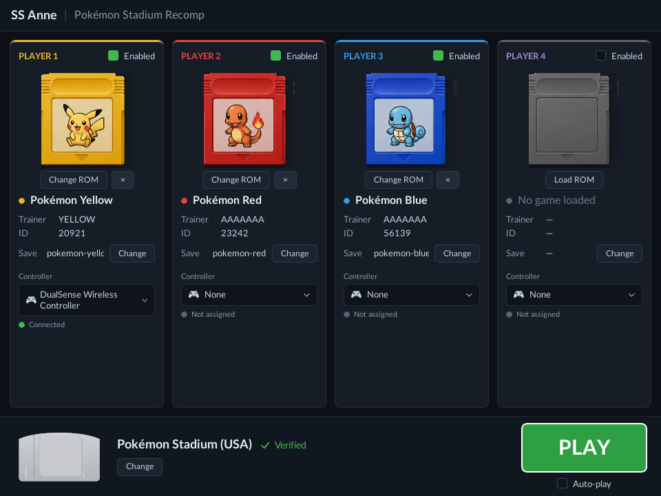

# PokemonStadiumRecomp — SS Anne

Static recompilation of **Pokémon Stadium (US v1.0)** to native PC.
Built on top of [N64Recomp](https://github.com/N64Recomp/N64Recomp).

This project is **SS Anne**, a Pokémon Stadium recompilation: it turns the
original game into a native PC program instead of running it in an
emulator. It is built on the N64Recomp toolchain and depends on a set of
companion forks maintained alongside it:

- [N64Recomp](https://github.com/mstan/N64Recomp) — the static recompiler
- [N64ModernRuntime](https://github.com/mstan/N64ModernRuntime) — the runtime that stands in for the N64's operating system
- [rt64](https://github.com/mstan/rt64) — the graphics renderer

Each of those repositories lists, at the top of its own README, the
changes made to it for this project.

## Changes in this fork

What this project adds, in plain terms:

- **Makes Pokémon Stadium run as a native PC program** instead of inside
  an emulator. Most of the work is teaching the recompilation toolchain
  about this one specific game.
- **Transfer Pak support** — the game can read a Pokémon party from your
  own Game Boy cartridge, the way the real Transfer Pak accessory did, and
  save back to it. See [Transfer Pak](#transfer-pak).
- **GB Tower works** — the Game Boy emulator built into Stadium can play
  full Game Boy games. See [GB Tower](#gb-tower).
- **A setup screen before the game starts** — the SS Anne launcher, for
  choosing carts and controllers. See
  [The SS Anne launcher](#the-ss-anne-launcher).
- **Your progress is saved** — registered Pokémon are remembered between
  sessions, and sound plays through whatever output device your system is
  set to use.
- **The game looks sharper** — anti-aliasing is on by default (4× MSAA) to
  smooth the N64 models' hard polygon edges, and the renderer can
  **supersample** (render above the window resolution and filter down) to
  clean up the thin, far-away geometry that aliasing alone can't fix. The
  2D menus and HUD stay crisp at any internal resolution. See
  [Configuration](#configuration).
- **All the under-the-hood fixes** listed in the three companion projects
  above — graphics glitches, audio timing, and crashes/freezes. Each of
  those READMEs describes its own changes.

## Status

This is a work-in-progress recompilation. The list below reflects what
has actually been exercised, not everything the game contains. Known
issues are tracked in [`ISSUES.md`](ISSUES.md); expect occasional audio
crackle and some menu-level visual glitches.

**Tested and working:**

- Boot, the title / attract sequence, and the in-game **menus**.
- The **SS Anne launcher** (see below).
- The **Kid's Club mini-games**.
- **GB Tower** — the Game Boy player built into Stadium. Pokémon Red, Blue,
  and Yellow play from start to live gameplay, your cartridge's save is read
  and written back, and the Game Boy sound comes through your speakers.
  (The Game Boy games themselves run in an emulator — but that emulator is
  *built into Pokémon Stadium*, so it gets turned into native PC code right
  along with the rest of the game.)
- **Transfer Pak** — import your party from your own Game Boy Pokémon
  cartridge (Game Pak Check / Registration), and the Pokémon you register
  are remembered between sessions. Up to four players' controllers and
  cartridges, on ports 1–4.
- **Entering and exiting a battle** — a battle starts, plays, and returns
  to the menu.

**Not yet tested end-to-end:**

- A full Stadium **cup** has **not** been run from start to finish.
- **Gym Leader Castle** has **not** been run from start to finish.
- Individual battles work, but completing an entire cup or Gym Leader
  Castle run — multiple consecutive battles with the full
  win/loss/progression flow — has **not** been validated end-to-end.

**First launch:** the project opens the SS Anne launcher. If no ROM has
been remembered yet it pops a file picker; point it at your own legal
Pokémon Stadium (US v1.0) ROM (`.z64` / `.n64` / `.v64`). The path is
remembered (`rom.cfg` next to the exe) and CLI arg `argv[1]` is also
honored for scripted runs.

## The SS Anne launcher

On launch the project shows an in-app configuration screen — the **SS
Anne launcher** — before the game boots, replacing the original
straight-to-game boot.



From the launcher you can:

- Assign a **Game Boy cart (Transfer Pak)** to each of the four player
  slots, with per-slot enable toggles. Cart art, trainer name, and ID are
  read from the configured ROM + save.
- Assign a **controller** to each slot (one device per slot), routed to
  that player's port when the game starts.
- Confirm the **Stadium (N64) ROM** (shown verified) and change it.
- Toggle **Auto-play**: a 5-second countdown that starts the game once the
  configuration is valid, so a controller-only user can opt into just
  waiting. It is **off by default**; the preference is persisted to
  `launcher.cfg` (`autoplay=on|off`) and can be overridden at launch with
  the `PSR_AUTOPLAY` environment variable (`PSR_AUTOPLAY=1` enables it,
  `PSR_AUTOPLAY=0` disables it).
- Press **PLAY** (enabled once at least one enabled slot has a controller).

`PSR_AUTOBOOT=1` skips the launcher entirely and boots straight into the
game (used for regression runs).

## Controls

Default bindings (per-button remapping in the launcher is planned).

**Game controller** (Xbox-style layout; DualSense / DualShock map the same way):

| N64 | Controller |
|-----|------------|
| A / B | A / B |
| Start | Start |
| **L** / **R** | **Left / Right bumper (LB / RB)** |
| **Z** | **Either trigger (LT / RT)** |
| D-Pad | D-Pad |
| Control Stick | Left stick |
| C-Buttons | Right stick (push up / down / left / right) |

(Earlier builds put N64 **L** on the left-stick *click*, where it was easy to
miss — issue #8. L and R are now the bumpers.)

**Keyboard:** `X`→A, `Z`→B, `Enter`→Start, `Q`→L, `E`→R, `Left-Shift`/`Space`→Z,
arrow keys→D-Pad, `W`/`A`/`S`/`D`→Control Stick, `I`/`K`/`J`/`L`→C-Up/Down/Left/Right.

## Configuration

- **RT64-backed rendering** with internal-resolution upscaling.
- **Smoother graphics, on by default.** The game runs with anti-aliasing
  (4× MSAA) so the models' edges aren't jagged. You don't have to set
  anything — it just looks better out of the box. The 2D menus stay sharp.
- **Optional: render at a higher resolution (supersampling).** If you have a
  capable GPU and want the far-away, thin parts of the models even cleaner,
  you can have the game draw at a higher resolution and shrink the result
  down. It's off by default; turn it on with these environment variables
  (see [`docs/graphics.md`](docs/graphics.md) for the full list and
  examples):
  - `PSR_RT64_RES_MULT` — how much higher than the window to render
    (e.g. `2` for double).
  - `PSR_RT64_DOWNSAMPLE` — how much to shrink it back down before showing
    it. Using both together is what gives the cleanest image.
  - `PSR_RT64_MSAA` — change the anti-aliasing level (`None`, `2X`, `4X`,
    `8X`) if the default doesn't suit your GPU.
- **Audio** plays through your system's default output device; override
  with `PSR_AUDIO_DEVICE=<name substring>`.
- **Fullscreen at launch.** By default the game opens in a window; press
  **Alt + Enter** to toggle fullscreen at any time. To have it *open*
  fullscreen every time, set `window_mode=fullscreen` in `launcher.cfg`
  (next to the exe), or launch with `PSR_FULLSCREEN=1` (equivalently
  `PSR_WINDOW_MODE=fullscreen`). The env vars override the file for that one
  run without changing it; `PSR_FULLSCREEN=0` / `PSR_WINDOW_MODE=windowed`
  force windowed. See [Configuration](#configuration) keys below.
- **Game-controller input** (including DualSense / DualShock).
- Configured via environment variables and `*.cfg` files placed next to
  the exe (`rom.cfg`, `launcher.cfg`).

## Troubleshooting

### Windows says the download is a virus / SmartScreen blocks it

Some antivirus products — and **Windows Smart App Control** in particular —
flag the release `.zip` or the `.exe` and may delete it automatically. **This
is a false positive.** Two things set heuristic scanners off:

- The executable is **statically recompiled** N64 code. The instruction
  patterns don't look like a normal compiler's output, which trips
  signature-free heuristics.
- The release binary is **not code-signed**. Code-signing requires a paid
  (EV) certificate; until the project has one, unsigned builds will keep
  drawing SmartScreen warnings regardless of what they contain.

To proceed:

1. Restore the file from quarantine, or add an exclusion for the folder you
   extracted it to (Windows Security → *Virus & threat protection* →
   *Manage settings* → *Exclusions*). With **Smart App Control** on, you may
   need to turn it off (it can't be exclusion-listed) — note that this is a
   one-way switch until a Windows reset.
2. If you'd rather not trust a prebuilt binary at all, **build it yourself
   from source** — the whole toolchain is in this repo and the companion
   forks. See [Quick start](#quick-start). A build you compiled locally
   won't be flagged.

There is no malware in the release. The source is fully public; you're
welcome to inspect or rebuild it.

### No sound

Audio plays through your system's **default output device**. If you get no
sound at all:

1. **Make sure you're on the latest release.** Early builds shipped before
   the audio path was finished; current releases (v0.4.2-beta and later)
   have working sound. Grab the newest from the
   [Releases](https://github.com/mstan/PokemonStadiumRecomp/releases) page.
2. **Check which device is default** in Windows Sound settings — the game
   follows it. If your default is a device that's off or muted, you'll hear
   nothing.
3. **Force a specific device** with `PSR_AUDIO_DEVICE=<name substring>`
   (e.g. `PSR_AUDIO_DEVICE=Speakers`). The match is a case-sensitive
   substring of the device name; the first device that matches is used.

A subtle **audio crackle** during gameplay is a separate, known issue that's
being worked on — it's in the recompiled N64 sound synthesis, not your
device. `PSR_DISABLE_GBTOWER_AUDIO=1` silences only the GB Tower audio path
if you want to isolate it.

## ROM

| Field | Value |
|-------|-------|
| Title | Pokémon Stadium (US, v1.0) |
| MD5   | `ed1378bc12115f71209a77844965ba50` |
| Size  | 33,554,432 bytes (32 MB) |
| Format | `.z64` (big-endian native, magic `80 37 12 40`) |

**Rev A (v1.1) is not compatible** — pret's disassembly targets v1.0
specifically, and the address tables in `disasm/yamls/us/rom.yaml`
will not align with a Rev A binary. If you have Rev A, find a v1.0
dump.

## Layout

```
PokemonStadiumRecomp/
├── baserom.z64                     # canonical ROM (gitignored)
├── disasm/                         # pret/pokestadium submodule
├── n64recomp/                      # N64Recomp engine (junction by setup)
├── ares-bridge/                    # Ares oracle integration (TODO subproject)
├── ghidra/                         # Ghidra project + instructions
├── generated/                      # recompiler C output (gitignored)
├── tools/                          # game-specific tooling
├── tests/                          # regression tests
├── docs/                           # design notes
├── game.toml                       # N64Recomp config
├── n64recomp.pin                   # engine SHA pin
├── CMakeLists.txt                  # build entrypoint
├── setup.sh / setup.bat            # provisioning
├── DEBUG.md                        # divergence triage protocol
├── ISSUES.md / MODDING.md
└── README.md
```

## Quick start

Prereqs: git, python3, cmake 3.20+, a working C/C++ toolchain. For
the disasm build (optional): `make`, `binutils-mips-linux-gnu`.

```bash
# Linux / macOS
chmod +x setup.sh && ./setup.sh

# Windows
setup.bat
```

This:
1. Clones (or junctions) `n64recomp/` at the SHA pinned in
   `n64recomp.pin`.
2. Initializes the `disasm/` submodule (pret/pokestadium).
3. Stages `baserom.z64` into `disasm/baseroms/us/`.

Optional: clone the Ares oracle with `WITH_ARES=1 ./setup.sh`. See
the *Oracle* section below — the bridge code is not yet written.

To build the disasm (sanity check that the ROM and pret align):

```bash
cd disasm
make init     # extracts assets from the staged baserom
make          # rebuilds an identical pokestadium-us.z64 from sources
```

## Transfer Pak

Stadium reads your Pokémon party out of a Game Boy cart through the
N64 Transfer Pak accessory. This runtime ships a hardware-level
emulator of that accessory plus the Game Boy cart it bridges to, so
the in-game Game Pak Check menu sees the configured ROM/save as if
a real cart were plugged into a Transfer Pak in port 1.

**Supported games:** the Gen 1 and Gen 2 Pokémon Game Boy titles — Red,
Blue, Yellow, Gold, Silver, and Crystal. Your cartridge's save is written
back to disk as you play, so progress isn't lost.

**Configuration.** The SS Anne launcher normally writes `launcher.cfg`
for you (it is the launcher's persistent store — see
[The SS Anne launcher](#the-ss-anne-launcher)), but you can also hand-edit
or create it next to the exe:

```ini
# Paths are relative to this file (or absolute).
p1_rom=pokemon-yellow.gbc
p1_save=pokemon-yellow.sav
```

Keys are `pN_rom` / `pN_save` for ports 1–4. Environment variables
`PSR_TRANSFER_PAK_P{1..4}_ROM` and `..._SAVE` override the config
file. Set `PSR_TRANSFER_PAK_DEBUG=1` for verbose bus-level tracing
(off by default).

`launcher.cfg` and `*.gb` / `*.gbc` are gitignored — bring your
own legal dumps.

## Pipeline overview

```
disasm/  +  baserom.z64    -->  pret build      -->  pokestadium-us.elf
                                  (make init && make)         |
                                                              v
                          game.toml  +  N64RecompCLI  -->  generated/*.c
                                                              |
                                                              v
                                  CMake build  +  N64ModernRuntime
                                                              |
                                                              v
                                                  PokemonStadiumRecomp.exe
```

The disasm produces an ELF that already encodes every section's
load VA, symbols, and relocations. **N64Recomp consumes the ELF
directly** — there's no per-fragment slicing step. Ghidra also
imports the ELF directly (see `ghidra/instructions.txt`).

## Overlays — flat VA, not NES-style banks

Pokémon Stadium has a flat 8 MB virtual address space and uses
DMA-loaded *fragments* (overlays). Verified from
`disasm/yamls/us/rom.yaml`:

- 77 numbered fragments at **mostly unique VRAM addresses**
  (`0x81200000`, `0x87800000`, `0x87900000`, `0x8F000000`, …).
- Only **2 placeholder VRAM collisions** (`0x8FC00000` ×2,
  `0x88920000` ×2), commented in pret as "unk VRAM, shuts linker
  up" — likely not real runtime collisions.

This is **unlike NES bank-switching** (where every bank shares
`0x8000-0xFFFF`). For PokemonStadium the disasm's ELF is sufficient
for both N64Recomp and Ghidra; per-fragment extraction is not
needed and the project doesn't ship that tooling.

## GB Tower

Stadium's built-in **GB Tower** lets you play full Game Boy games on the
big screen, right inside Pokémon Stadium — different from the Transfer Pak,
which only imports a *party* (see above). It **works**: Pokémon Red, Blue,
and Yellow play to live gameplay, your cartridge save is read and written
back, and the Game Boy sound plays through your speakers.

A note for the curious: the Game Boy games genuinely run in an emulator,
the way they always did inside Pokémon Stadium. The difference here is that
the emulator — which is part of the Pokémon Stadium game itself — is
recompiled into native PC code along with everything else, rather than being
run by a separate emulator on top.

GB Tower reads carts through the same Transfer Pak cart model, so you
supply your own legal GB/GBC ROM + save the same way — via
`launcher.cfg` (`p1_rom` / `p1_save`) or the
`PSR_TRANSFER_PAK_P{1..4}_ROM` / `..._SAVE` environment variables. In the
game: **POKéMON STADIUM → right to the giant Game Boy (GB Tower) → pick a
cart → A**. The 1P slot is the default cart; additional ports map to the
2P/3P carts.

`PSR_DISABLE_GBTOWER_AUDIO=1` is available as a diagnostic opt-out for
the GB audio path.

## Out of scope (first pass)

Nothing major remains explicitly out of scope for the base game at this
point — GB Tower (above) was the last big "out of scope" item and is now
in. Remaining gaps are tracked as ordinary issues in
[`ISSUES.md`](ISSUES.md) rather than scope exclusions.

## Oracle (Ares)

Divergence checking against a reference emulator is currently done by
manual side-by-side runs against [ares](https://ares-emu.net/). An
automated bridge — running Ares in-process as an oracle and diffing N64
state against it — is a planned follow-up, not part of the current build.
The slot is reserved at `ares-emulator/` (opt-in via `WITH_ARES=1` in
setup); the bridge code (`ares_bridge.cpp`, `n64_snapshot.c`,
`verify_mode.c`, `watchdog.c`) is not yet written. Tracked in `ISSUES.md`.

## Documentation

- [`docs/graphics.md`](docs/graphics.md) — anti-aliasing + supersampling options.
- [`DEBUG.md`](DEBUG.md) — debug + divergence protocol.
- [`ISSUES.md`](ISSUES.md) — known issues + open work.
- [`MODDING.md`](MODDING.md) — modding hooks (post-MVP).
- [`ghidra/instructions.txt`](ghidra/instructions.txt) — Ghidra setup.

## Acknowledgements

- [pret/pokestadium](https://github.com/pret/pokestadium) — the Pokémon
  Stadium disassembly this project builds on.
- the [ares](https://ares-emu.net/) emulator team — accuracy reference.

## License

PokemonStadiumRecomp is distributed under the **GNU General Public
License, version 3** — see [`COPYING`](COPYING).

It is built from several components under their own licenses, whose terms
and copyright notices are retained in their respective repositories:

- N64ModernRuntime — GPL-3.0 (`COPYING`)
- N64Recomp — MIT (`LICENSE`)
- rt64 — MIT (`LICENSE`)

The original game's assets are **not** included; a legal copy of the
Pokémon Stadium (US v1.0) ROM is required to build or run this project.
